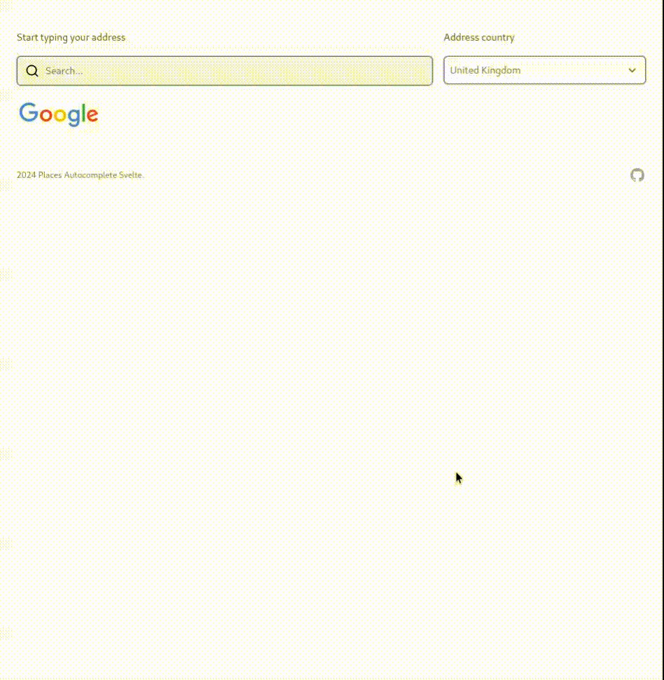

# Places (New) Autocomplete Svelte

This Svelte component provides a user-friendly way to search for and retrieve detailed address information within your [SvelteKit](https://kit.svelte.dev) applications, leveraging the power of the [Google Maps Places (New) Autocomplete API](https://developers.google.com/maps/documentation/javascript/place-autocomplete-overview).  It comes with default styling using [Tailwind CSS](https://tailwindcss.com/), which you can fully customise.


## Features

- **Seamless SvelteKit Integration:** Easily add the component to your SvelteKit projects.
- **Real-time Autocomplete Suggestions:**  As the user types, address suggestions appear dynamically.
- **Comprehensive Address Details:** Retrieve detailed information, including street address, city, state/province, postal code, country, and more.
- **Country/Region Filtering:** Narrow down search results by specifying target countries or regions.
- **Customizable Styles:** Tailor the component's appearance to match your application's design by overriding the default Tailwind CSS classes.
- **Flexible Data Control:** Choose the specific data fields you want to retrieve using the `fetchFields` property.
- **Keyboard Navigation & Accessibility:**  Use keyboard navigation for selecting suggestions, ensuring accessibility for all users.


## Demo

See a live demo of the component in action: [Basic Example](https://places-autocomplete-demo.pages.dev/)

[Reactive parameters](https://places-autocomplete-demo.pages.dev/examples/reactive-parameters) - change the search criteria based on user input, like filtering by country or change results language.

[Customise request parameters](https://places-autocomplete-demo.pages.dev/examples/customise-request-parameters) - construct a `requestParams` object and control various aspects of the search, including language, region, and more.




## Requirements

- **Google Maps API Key** with the Places API (New) enabled. Refer to [Use API Keys](https://developers.google.com/maps/documentation/javascript/get-api-key) for detailed instructions.

## Installation Svelte 5

```bash
npm i places-autocomplete-svelte
```

## Installation Svelte 4

```bash
npm i places-autocomplete-svelte@1.0.1
```


## Basic Usage

1. Replace `'___YOUR_API_KEY___'` with your actual **Google Maps API Key**.
2. Use the `onResponse` callback to **handle the response**.

```svelte
<script>
import { PlaceAutocomplete } from 'places-autocomplete-svelte';

//Recommended: Store your key securely as an environment variable
const PUBLIC_GOOGLE_MAPS_API_KEY = '___YOUR_API_KEY___';


let fullResponse = $state('')
let onResponse = (response) => {
	fullResponse = response;
};
</script>

<PlaceAutocomplete  {onResponse} {PUBLIC_GOOGLE_MAPS_API_KEY} />

<p>Response Object: {JSON.stringify(fullResponse, null, 2)}</p>
```


## Component Properties

| Property                 | Type            | Description                                                                                                                                                                                                                        | Required | Default Value                               |
|--------------------------|-----------------|---------------------------------------------------------------------------------------------------------------------------------------------------------------------------------------------------------------------------------|----------|-----------------------------------------------|
| `PUBLIC_GOOGLE_MAPS_API_KEY` | `String`        | Your Google Maps Places API Key.                                                                                                                                                                                             | Yes       |                                               |
| `onResponse`              | `CustomEvent`    | Dispatched when a place is selected, containing the place details in `event.detail`.                                                                                                                                              | Yes       |                                               |
| `onError`                 | `CustomEvent`    | Dispatched when an error occurs, with the error message in `event.detail`.                                                                                                                                                 | No        |                                               |
| `requestParams`          | `Object`        | Object for additional request parameters (e.g., `types`, `bounds`, `origin`, `region`, `language`). See [AutocompleteRequest](https://developers.google.com/maps/documentation/javascript/reference/autocomplete-data#AutocompleteRequest). | No        | `{}`                                       |
| `fetchFields`            | `Array`         | Array of place data fields to return. See [Supported Fields](https://developers.google.com/maps/documentation/javascript/reference/places-service#PlaceResult)                                                            | No        | `['formattedAddress', 'addressComponents']` |
| `options`                | `Object`        |  Options for customizing the component's behavior and appearance. See "Customization" below.                                                                                                                               | No        | See default values in "Customization"       |


## Customization
### Options

| Property       | Type      | Description                                                                                                                                                  | Default Value |
|----------------|-----------|--------------------------------------------------------------------------------------------------------------------------------------------------------------|---------------|
| `autofocus`    | `boolean` | If `true`, the input field will be focused automatically when the component mounts.                                                                        | `false`       |
| `placeholder` | `String`   | Placeholder text for the input field.                                                                                                                      | `"Search..."` |
| `autocomplete`| `string`  | HTML `autocomplete` attribute for the input field. Set to `"off"` to disable browser autocomplete.                                                          | `"off"`      |
| `show_distance`| `boolean` | If `true`, and if an `origin` is specified in `requestParams`, displays the distance to each suggestion. The distance is calculated as a geodesic in meters. | `false`       |
| `classes`     | `Object`   | Object to override default Tailwind CSS classes.                                                | See [styling](https://places-autocomplete-demo.pages.dev/examples/styling)    |

### Styling
Customise the component's appearance by providing an object to the classes property. This object should contain key-value pairs, where the keys correspond to the component's elements and the values are your custom CSS class names. See [styling](https://places-autocomplete-demo.pages.dev/examples/styling) for details.


### Request Parameters (requestParams)
Fine-tune the autocomplete search with the requestParams property. This property accepts an object corresponding to the AutocompleteRequest object in the Google Maps API documentation. See this [request parameters](https://places-autocomplete-demo.pages.dev/component/request-parameters) for more details. Here are some common examples:

```svelte
<script>
// ... other imports

/**
 * @type object optional
 * AutocompleteRequest properties
 */
const requestParams = {
	/**
	 * @type string optional
	 */
	language : 'en-GB',
	/**
	 * @type string optional
	 */
	region : 'GB',
}

/**
 * @type object optional
 * Options
 */
const options = {
	autofocus: false,
	autocompete: 'off',
	placeholder: 'Start typing your address',
	show_distance: true,
};

/**
 * @type array optional
 */
const fetchFields = ['formattedAddress', 'addressComponents'];
</script>

<PlaceAutocomplete 
	{onError} 
	{onResponse} 
	{PUBLIC_GOOGLE_MAPS_API_KEY} 
	{requestParams}
	{options} 
	{fetchFields}
	
/>

```


## Error Handling

Use the `onError` event handler to gracefully manage any errors that may occur during the autocomplete process:


```svelte
<script>
// ... other imports

// Error handler
let pacError = '';
let onError = (error: string) => {
	console.error(error);
	pacError = error;
};
</script>

<PlaceAutocomplete 
{onResponse} 
{onError} 
{PUBLIC_GOOGLE_MAPS_API_KEY} />

{#if pacError}
	<p class="error">{pacError}</p>
{/if}
```

## Contributing

Contributions are welcome! Please open an issue or submit a pull request on the [GitHub](https://github.com/alexpechkarev/places-autocomplete-svelte/).

## License

[MIT](LICENSE)